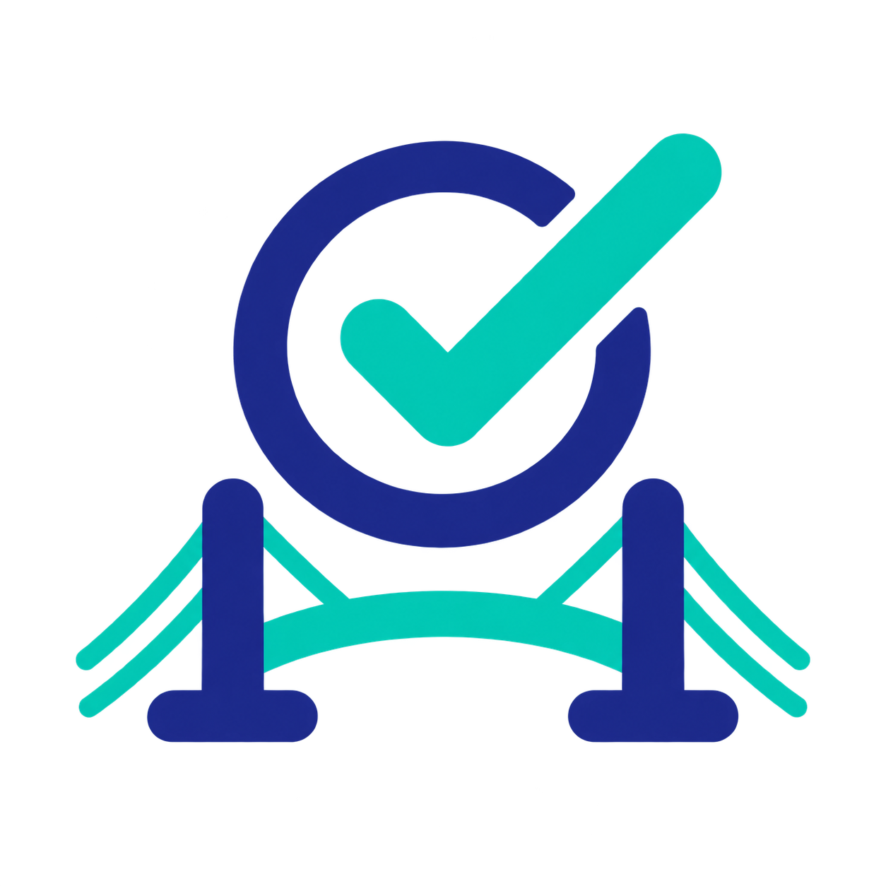

# TaskBridge

TaskBridge lets you use Google Tasks from Codex or any MCP client that can run a local STDIO server. It can list task lists and tasks, create or edit tasks, mark tasks complete, and delete tasks after explicit confirmation.



Everything runs locally. The server talks directly to the Google Tasks API and stores the OAuth token on your computer.

## What you need

- [Node.js](https://nodejs.org/) 20 or newer
- A Google account with Google Tasks enabled
- A Google Cloud project
- Codex, the ChatGPT desktop app, or another MCP client with local STDIO support

## Set up the project

### 1. Download and install

```powershell
git clone <repository-url>
cd google-task-mcp
npm install
```

Run the checks to confirm that your local copy is ready:

```powershell
npm run verify
```

### 2. Create Google OAuth credentials

1. Open the [Google Cloud Console](https://console.cloud.google.com/) and create or select a project.
2. Enable the [Google Tasks API](https://console.cloud.google.com/apis/library/tasks.googleapis.com).
3. Open **Google Auth platform → Branding** and configure the consent screen.
4. Under **Audience**, use **Internal** for a Google Workspace organization or **External** for a personal Google account. If the app is in testing, add the Google account you will use as a test user.
5. Open **Google Auth platform → Clients**, select **Create client**, and choose **Desktop app**.
6. Copy the generated client ID and client secret.

Google supports loopback addresses for desktop OAuth clients, so the included local callback URL works without hosting a web server. See Google's [Tasks API Node.js quickstart](https://developers.google.com/workspace/tasks/quickstart/nodejs) and [desktop OAuth guidance](https://developers.google.com/identity/protocols/oauth2/native-app) for more detail.

### 3. Add your credentials

Create a local `.env` file from the example:

```powershell
Copy-Item .env.example .env
```

On macOS or Linux, use `cp .env.example .env` instead. Then replace the placeholder values:

```dotenv
GOOGLE_TASKS_CLIENT_ID=your-client-id.apps.googleusercontent.com
GOOGLE_TASKS_CLIENT_SECRET=your-client-secret
GOOGLE_TASKS_REDIRECT_URI=http://127.0.0.1:53682/oauth2callback
```

The server loads this `.env` file from the repository directory even when it is launched from somewhere else. `.env` is ignored by Git.

### 4. Connect Codex

The simplest development setup is to add this repository as a local MCP server. Replace the example path with the absolute path to your clone:

```powershell
codex mcp add google-task-mcp -- node C:\path\to\google-task-mcp\server\index.js
```

You can also add it in the ChatGPT desktop app under **Settings → MCP servers → Add server**:

- Name: `google-task-mcp`
- Type: `STDIO`
- Command: `node`
- Arguments: the absolute path to `server/index.js`

Save the server and restart the app. Codex's MCP configuration is shared with the desktop app and IDE extension; the current options are documented in the [official MCP setup guide](https://developers.openai.com/codex/mcp).

This repository also contains `.codex-plugin/plugin.json` and `.mcp.json` for packaging it as a Codex plugin.

### 5. Authorize Google Tasks

Start a new chat and ask:

> Connect my Google Tasks account.

The client should call `google_tasks_get_authorization_url`. Open the returned URL, approve access, return to the chat, and ask it to finish authorization. The authorization attempt expires after 10 minutes.

Try one of these prompts afterward:

- “Show my open Google Tasks.”
- “Create a task called Pay electricity bill due tomorrow.”
- “Mark my grocery task complete.”

## Available tools

| Tool | Purpose |
| --- | --- |
| `google_tasks_get_authorization_url` | Start local Google OAuth authorization |
| `google_tasks_complete_authorization` | Finish authorization after browser consent |
| `google_tasks_list_tasklists` | List task lists |
| `google_tasks_list_tasks` | List tasks, optionally including completed or hidden tasks |
| `google_tasks_create_task` | Create a task or subtask |
| `google_tasks_update_task` | Change a task's title, notes, or due date |
| `google_tasks_set_task_completion` | Complete or reopen a task |
| `google_tasks_delete_task` | Permanently delete a task after explicit confirmation |

Task list IDs default to `@default`. Due dates use RFC 3339 timestamps, such as `2026-08-18T17:00:00Z`; Google Tasks stores the date and may discard the time portion.

## Local data and safety

- The OAuth token is stored at `%APPDATA%\google-task-mcp\token.json` on Windows or `~/.config/google-task-mcp/token.json` on macOS and Linux.
- Set `GOOGLE_TASKS_TOKEN_PATH` in `.env` to use a different location.
- Delete the token file to disconnect the Google account. You can also revoke access from your Google Account settings.
- The server requests only `https://www.googleapis.com/auth/tasks`.
- Task deletion requires `confirm: true`; clients should show the exact task and ask before calling it.
- `.env`, token directories, logs, and dependencies are excluded from Git. Never commit credentials or tokens.

## Troubleshooting

**The MCP server exits immediately**

Check that `.env` exists beside `package.json` and contains both `GOOGLE_TASKS_CLIENT_ID` and `GOOGLE_TASKS_CLIENT_SECRET`.

**Google reports `redirect_uri_mismatch`**

Confirm that you created a **Desktop app** OAuth client and kept `GOOGLE_TASKS_REDIRECT_URI` set to the included loopback URL.

**The authorization URL expires**

Run `google_tasks_get_authorization_url` again. Only one authorization attempt can be active at a time.

**Port 53682 is already in use**

Choose an unused local port in `.env`, restart the MCP server, and begin authorization again.

## Development

The server is split by responsibility:

```text
server/
  config.js       Environment and path configuration
  google-auth.js  OAuth callback and Google API client
  index.js        Server startup
  mcp-result.js   MCP text response formatting
  tools.js        Tool schemas and handlers
test/              Node.js unit tests
```

Useful commands:

```powershell
npm run check   # Syntax-check server files
npm test        # Run unit tests
npm run verify  # Run both checks
npm start       # Start the STDIO server manually
```

OAuth and live Google API calls require real credentials and interactive browser consent. Unit tests do not contact Google.

## License

Released under the [MIT License](LICENSE).
